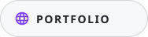
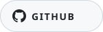
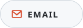
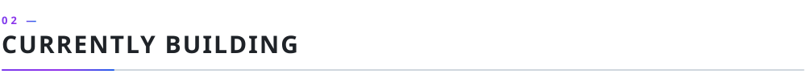
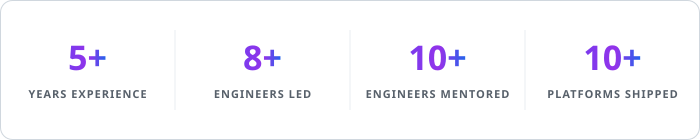
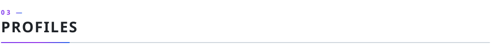
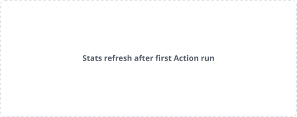
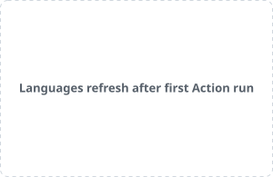
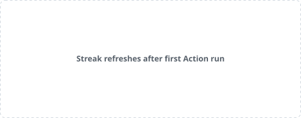

<h1 align="center">Hi, I'm Sushil Choudhary 👋</h1>

  <b>FRONTEND ENGINEER &nbsp;·&nbsp; REACT &amp; REACT NATIVE &nbsp;·&nbsp; TYPESCRIPT &nbsp;·&nbsp; MICRO-FRONTEND ARCHITECTURE</b>

  Building component-driven interfaces for web and mobile — from micro-frontend platforms 
  to apps shipped on the App Store and Play Store.

  <a href="https://sushil.vercel.app"><picture><source media="(prefers-color-scheme: dark)" srcset="assets/badges/portfolio-dark.svg"></picture></a>
  <a href="https://github.com/sushil-choudhary"><picture><source media="(prefers-color-scheme: dark)" srcset="assets/badges/github-dark.svg"></picture></a>
  <a href="https://www.linkedin.com/in/sushil-choudhary-0545211b3/"><picture><source media="(prefers-color-scheme: dark)" srcset="assets/badges/linkedin-dark.svg"></picture></a>
  <a href="mailto:sushilchoudhary9871@gmail.com"><picture><source media="(prefers-color-scheme: dark)" srcset="assets/badges/email-dark.svg"></picture></a>

 

<picture>
  <source media="(prefers-color-scheme: dark)" srcset="assets/sections/dark/01-about.svg">
  
</picture>

I build production React and React Native systems — component libraries, micro-frontend architectures, and cross-platform mobile apps that ship to real app stores, not demos.

Over 5+ years I've gone from intern to Team Lead, architecting Ed-Tech, Healthcare, and Enterprise SaaS platforms end-to-end — almost always as the engineer owning frontend architecture from the first component through production. I care more about reusable component design, feature-based architecture, and frontend performance (code-splitting, lazy loading, bundle discipline) than chasing every new framework.

I came in through a B.A. in History & Political Science, not a CS degree — turns out tracing root causes and thinking in systems transfers well to debugging and architecture. Today I lead 8+ engineers, have mentored 10+ across projects, and act as project auditor reviewing codebases and architecture for technical risk across the org.

 

<picture>
  <source media="(prefers-color-scheme: dark)" srcset="assets/sections/dark/02-focus.svg">
  
</picture>

- 🏗️ Driving **Webpack Module Federation** micro-frontend adoption across enterprise platforms, for independently deployable modules
- 🤖 Folding **Claude** into day-to-day frontend development, code review, and architecture audits
- 🧭 Serving as **project auditor** — reviewing codebases and architecture across teams for quality and technical risk
- 🎓 Anthropic-certified: Claude Code Actions · Agent AI · MCP Servers · Claude API &amp; Usage

  <picture>
    <source media="(prefers-color-scheme: dark)" srcset="assets/cards/snapshot-dark.svg">
    
  </picture>

 

<picture>
  <source media="(prefers-color-scheme: dark)" srcset="assets/sections/dark/03-profiles.svg">
  
</picture>

  &nbsp;&nbsp;&nbsp;
  &nbsp;&nbsp;&nbsp;
  &nbsp;&nbsp;&nbsp;
  

 

<picture>
  <source media="(prefers-color-scheme: dark)" srcset="assets/sections/dark/04-telemetry.svg">
  
</picture>

 
 

  <picture>
    <source media="(prefers-color-scheme: dark)" srcset="assets/cards/stats-dark.svg">
    
  </picture>
  <picture>
    <source media="(prefers-color-scheme: dark)" srcset="assets/cards/langs-dark.svg">
    
  </picture>

  <picture>
    <source media="(prefers-color-scheme: dark)" srcset="assets/cards/streak-dark.svg">
    
  </picture>

  <picture>
    <source media="(prefers-color-scheme: dark)" srcset="assets/snake-dark.svg">
    
  </picture>

  <picture>
    <source media="(prefers-color-scheme: dark)" srcset="assets/cards/activity-graph-dark.svg">
    
  </picture>

 

<picture>
  <source media="(prefers-color-scheme: dark)" srcset="assets/sections/dark/05-platforms.svg">
  
</picture>

Enterprise products architected and led independently as Team Lead / Senior Engineer. These are proprietary platforms — no public repos or live demos to link to, so scale is described instead of GitHub metrics.

<table>
<thead>
<tr>
<th align="left" width="26%">Platform</th>
<th align="left" width="38%">What it is</th>
<th align="left" width="36%">Stack &amp; scale</th>
</tr>
</thead>
<tbody>
<tr>
<td align="left"><b>Healthcare RPM Web Platform</b> Remote Patient Monitoring</td>
<td align="left">Vitals dashboard, Kanban-style CRM (@dnd-kit), rules engine, RBAC, HIPAA-aware design.</td>
<td align="left">React 18 · Redux · MUI · Tailwind · Vitest</td>
</tr>
<tr>
<td align="left"><b>LMS Administration Portal</b> Learning Management System</td>
<td align="left">LMS admin console with AI content generation and live WebSocket features.</td>
<td align="left">React 18 · Redux · MUI v7 · Webpack 5 MFE 15+ microservices</td>
</tr>
<tr>
<td align="left"><b>Patient, Provider &amp; Wellness Mobile App</b> React Native · iOS &amp; Android</td>
<td align="left">Dual-role patient/provider app with AI-assisted diet &amp; workout plans — live on both stores.</td>
<td align="left">React Native 0.81 · TypeScript · Redux Toolkit App Store &amp; Play Store · 8+ microservices</td>
</tr>
<tr>
<td align="left"><b>Ed-Tech Administration Portal</b> Student Information System</td>
<td align="left">Central admin hub for enrollment, programs, grading, reporting, and communication.</td>
<td align="left">React 18 · Redux · Webpack 5 MFE · Kubernetes multi-tenant</td>
</tr>
</tbody>
</table>

<b>Other platforms shipped</b>

 

<table>
<thead>
<tr>
<th align="left" width="34%">Platform</th>
<th align="left" width="66%">Stack</th>
</tr>
</thead>
<tbody>
<tr><td align="left">Student &amp; Parent Portal (SIS)</td><td align="left">React 18 · TypeScript · Redux · MUI v7 · i18next</td></tr>
<tr><td align="left">AI Assessment &amp; Grading Module (SIS)</td><td align="left">React 18 · Redux · MUI v5 · Webpack 5 MFE</td></tr>
<tr><td align="left">LMS Student Portal</td><td align="left">React 18 · TypeScript · Redux · WebSocket · Recharts</td></tr>
<tr><td align="left">License Management Dashboard</td><td align="left">Next.js 15 · React 19 · TypeScript · Redux Toolkit</td></tr>
<tr><td align="left">Patient Healthcare Mobile App</td><td align="left">React Native 0.68 · Redux · NativeBase · BLE Manager</td></tr>
<tr><td align="left">Enterprise Workflow Platform</td><td align="left">React · Redux · MUI · Webpack MFE</td></tr>
<tr><td align="left">Online Tutoring Platform</td><td align="left">React 16 · Redux · MUI · Socket.IO</td></tr>
<tr><td align="left">Internal Commerce &amp; Order Management</td><td align="left">Next.js 14 · TypeScript · Zustand · TanStack Query</td></tr>
</tbody>
</table>

 

<picture>
  <source media="(prefers-color-scheme: dark)" srcset="assets/sections/dark/06-stack.svg">
  
</picture>

<table>
<thead>
<tr>
<th align="center" width="22%">Area</th>
<th align="center" width="78%">Stack</th>
</tr>
</thead>
<tbody>
<tr>
<td align="left"><b>Languages</b></td>
<td align="left">   </td>
</tr>
<tr>
<td align="left"><b>Frontend</b></td>
<td align="left">    </td>
</tr>
<tr>
<td align="left"><b>Mobile</b></td>
<td align="left">   </td>
</tr>
<tr>
<td align="left"><b>UI &amp; Forms</b></td>
<td align="left">   </td>
</tr>
<tr>
<td align="left"><b>Testing &amp; Quality</b></td>
<td align="left">   </td>
</tr>
<tr>
<td align="left"><b>Backend &amp; APIs</b></td>
<td align="left">   </td>
</tr>
<tr>
<td align="left"><b>Delivery &amp; Tooling</b></td>
<td align="left">    </td>
</tr>
<tr>
<td align="left"><b>AI-Augmented Workflow</b></td>
<td align="left"> </td>
</tr>
</tbody>
</table>

 

<picture>
  <source media="(prefers-color-scheme: dark)" srcset="assets/sections/dark/07-experience.svg">
  
</picture>

<table>
<thead>
<tr>
<th align="left" width="28%">Role</th>
<th align="left" width="18%">Duration</th>
<th align="left" width="54%">Highlights</th>
</tr>
</thead>
<tbody>
<tr><td align="left"><b>Team Lead</b></td><td align="left">2026 – Present</td><td align="left">Leading 8+ engineers, driving micro-frontend adoption, project-auditing across the org.</td></tr>
<tr><td align="left"><b>Senior Software Engineer</b></td><td align="left">2025 – 2026</td><td align="left">Shipped React Native apps to both app stores; led frontend architecture for Ed-Tech SIS + LMS.</td></tr>
<tr><td align="left"><b>Software Engineer</b></td><td align="left">2023 – 2025</td><td align="left">Owned multi-step workflows and form systems end-to-end across web and mobile.</td></tr>
<tr><td align="left"><b>Web Developer</b></td><td align="left">2022 – 2023</td><td align="left">Built reusable UI components for tutoring and enterprise workflow platforms.</td></tr>
<tr><td align="left"><b>Web Developer Trainee → Intern</b></td><td align="left">2020 – 2022</td><td align="left">Self-taught React before a 3-month internship turned into a full-time career.</td></tr>
</tbody>
</table>

 

---

  <a href="https://sushil.vercel.app">Portfolio</a>
  &nbsp;·&nbsp;
  <a href="https://github.com/sushil-choudhary">GitHub</a>
  &nbsp;·&nbsp;
  <a href="https://www.linkedin.com/in/sushil-choudhary-0545211b3/">LinkedIn</a>
  &nbsp;·&nbsp;
  <a href="mailto:sushilchoudhary9871@gmail.com">Email</a>

  Telemetry cards and the contribution snake refresh automatically via GitHub Actions — see <a href="docs/MAINTENANCE.md">docs/MAINTENANCE.md</a>.

